# Peek

A Fabric mod that provides additional information about items and blocks.
Can be used client-side only.

## Optional Dependencies

- [ModMenu](https://modrinth.com/mod/modmenu)
- [ClothConfig](https://modrinth.com/mod/cloth-config)

## Features

**Shulker box hints** ([More information](https://modrepo.de/minecraft/peek/wiki/shulker_box_hints))

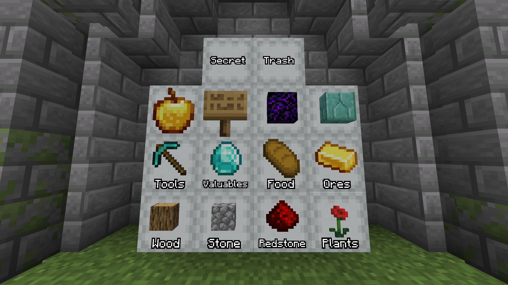

**Shulker box contents**

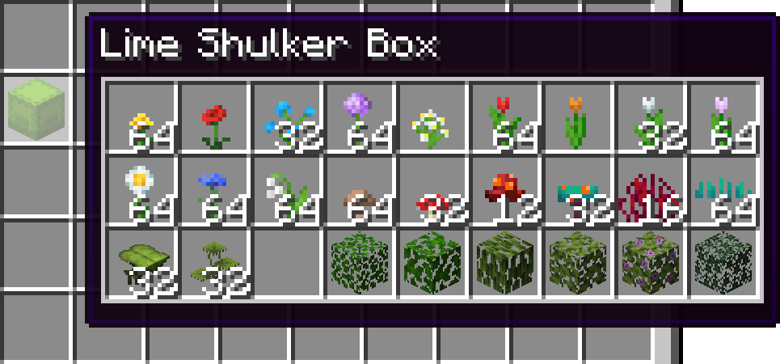

**Amount of bees in a bee nest**

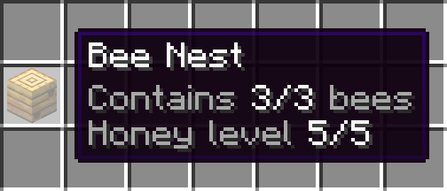

**Locations of markers on explorer maps**

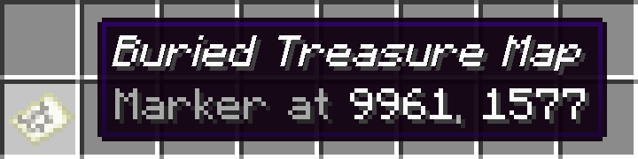

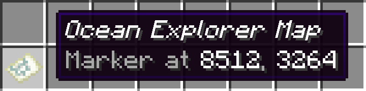

**Destinations of compasses**

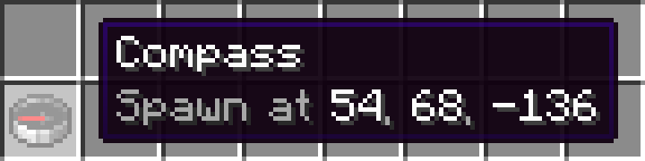

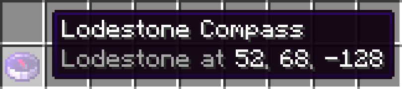

**Death locations of recovery compasses**

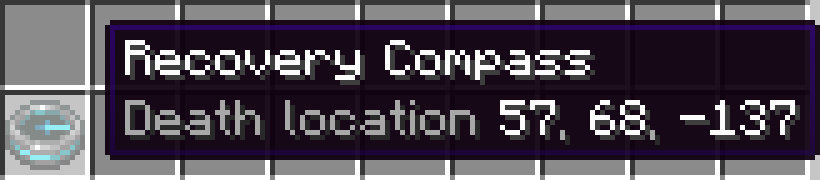

**Effects of suspicious stews**

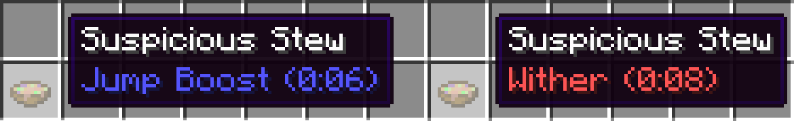

**Configurable bundle tooltip**

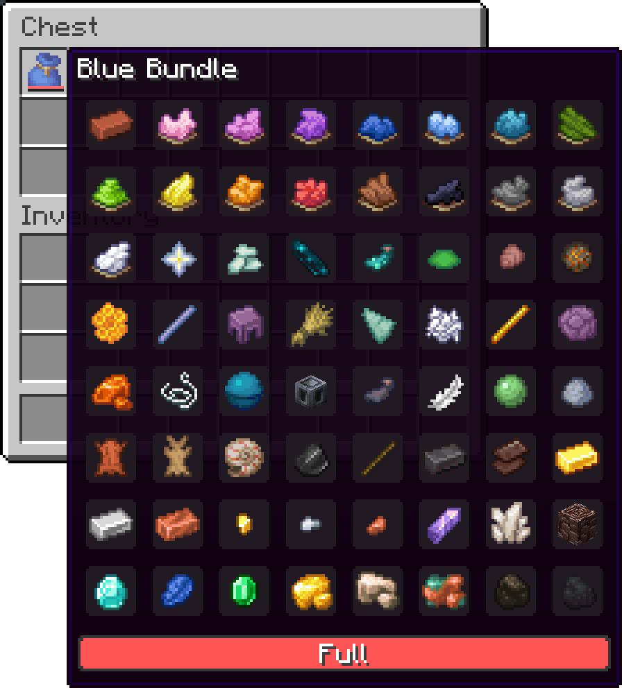

**Pick-blocked containers**

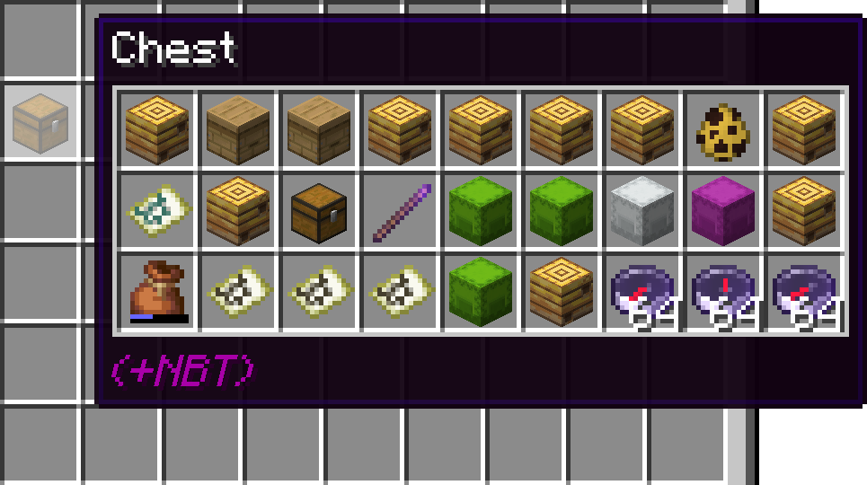

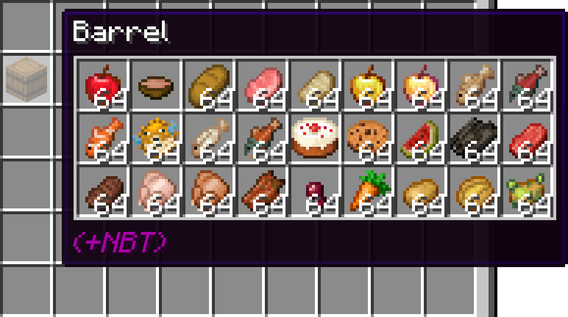

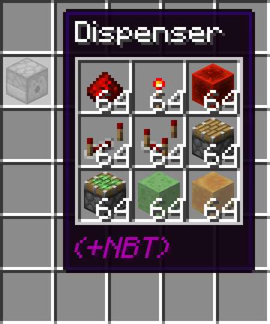

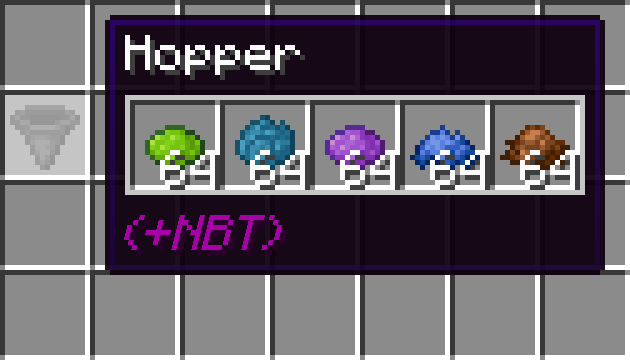

**Fully configurable with [ModMenu](https://www.curseforge.com/minecraft/mc-mods/modmenu) and [ClothConfig](https://www.curseforge.com/minecraft/mc-mods/cloth-config)**

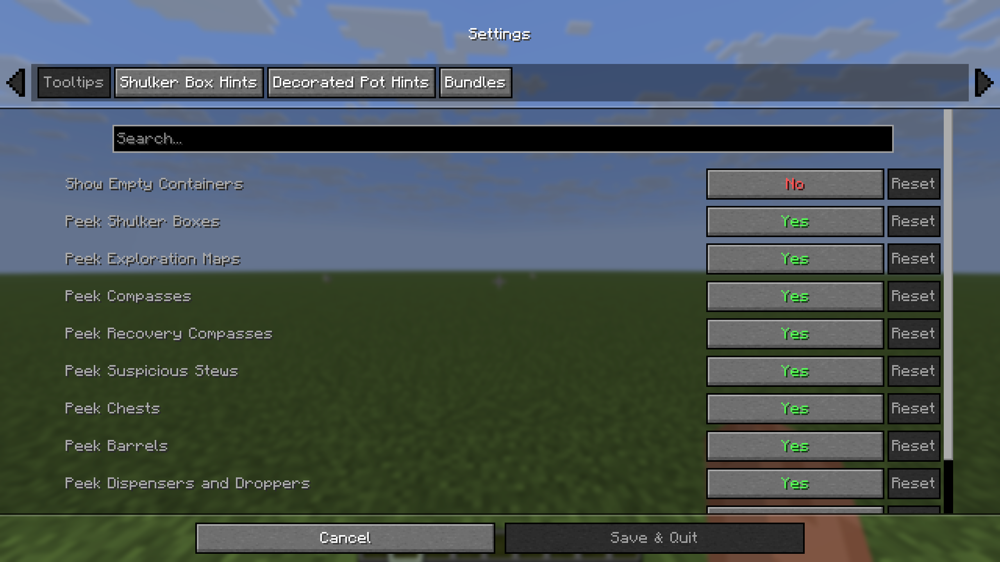
